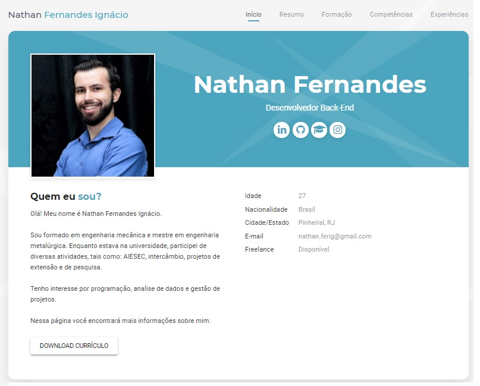

# Curriculum Vitae

> This repository contains a website with my curriculum vitae as it was in 2021. 

This repository was created by me and contains a website hosted on Github with the data of my [curriculum vitae](https://nathan-ferig.github.io/ "Curriculum Vitae") as it was in 2021. I've stopped updating this resume, but please refer to my [LinkedIn profile](https://www.linkedin.com/in/nathanferig/ "LinkedIn") to read a full and updated version of my experiences.

This project was part of an online course on Git & Github. This course was delivered by The Geek University and hosted at Udemy and can be found [here](https://www.udemy.com/course/curso-de-git-e-github-essencial/ "Git & Github essencial para o desenvolvedor"). The code was provide by the course instructors and can be found [here](https://github.com/felicityBR/felicityBR.github.io "Code repository"). I've built upon this code, modifying it to attend my needs. 

It was a interesting excercise in *html* and *css* and I'm proud of the results I've achieved with this code.
Thank you,

---

Nathan Ferig - [LinkedIn](https://www.linkedin.com/in/nathanferig/ "LinkedIn") - nathan.ferig@gmail.com